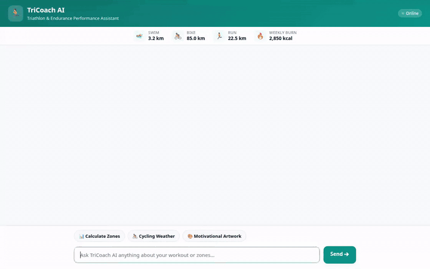

# TriCoach AI 🏃🚴🏊

An AI-powered endurance and triathlon coaching assistant built with the Google Agent Development Kit (ADK), Gemini 2.5 Flash, Google Cloud Vertex AI services, and an interactive A2UI chat interface.



---

## 🌟 Overview

**TriCoach AI** helps endurance athletes plan training schedules, calculate target heart rate and power zones, check real-time outdoor training weather, generate custom motivational workout artwork and training videos, and persist workout history in Google Cloud Firestore.

---

## 🛠️ Implemented Features & Google Cloud Integrations

The agent strictly implements the following features and Google Cloud services based on the codebase (`app/agent.py`, `app/tools.py`, `agents-cli-manifest.yaml`):

### 1. Memory Bank Service
- **Vertex AI Memory Bank Service**: Integrated via `VertexAiMemoryBankService` and `PreloadMemoryTool`. Session memories are ingested after each turn (`generate_memories_callback`), allowing the agent to remember athlete preferences, target race distances, injury history, and training thresholds across sessions.

### 2. Firestore Workout Catalog
- **Google Cloud Firestore**: Interacts with the `workouts` collection in project `qwiklabs-gcp-01-fde96ef80536`.
  - `log_workout`: Logs swim, bike, run, or strength workouts with duration, distance, rate of perceived exertion (RPE 1-10), and notes.
  - `query_workout_history`: Queries recent training records filtered by activity type.

### 3. Training Zone Calculator & Weather Safety
- `calculate_training_zones`: Computes target heart rate zones (Z1 Active Recovery to Z5 Anaerobic) and power zones (Z1 to Z5 Watts based on FTP).
- `get_outdoor_training_weather`: Fetches real-time temperature, wind speed, and humidity for outdoor training locations via Open-Meteo, generating training safety advice for cyclists and runners.

### 4. Multimodal Generation & Public Cloud Storage
- **Imagen Artwork Generation (`generate_workout_artwork`)**: Uses model `gemini-3.1-flash-lite-image` in the `global` region to produce motivational triathlon badges and mental imagery.
- **Omni Model Video Generation (`generate_workout_video`)**: Uses Google's `gemini-omni-flash-preview` via the GenAI Interactions API (`interactions.create` with streaming) to generate short training videos.
- **Google Cloud Storage (GCS)**: Stores generated media in a public bucket (`tricoach-ai-public-4798`) and saves session artifacts to the ADK Playground panel.

### 5. A2UI Adaptive Component Cards
- **A2UI Schema Manager (v0.8)**: Utilizes `A2uiSchemaManager` and `a2ui_callback` to stream structured UI cards (training schedules, workout tables, heart rate zone summaries, and weather warnings) directly into the chat interface.

### 6. Python Code Execution Sandbox
- **Agent Engine Sandbox**: Configured with `AgentEngineSandboxCodeExecutor` for secure server-side execution of Python code blocks (e.g. training load formulas, pace conversions).

---

## 🚀 Local Setup & Development

Follow these steps to run the TriCoach AI frontend and agent locally on your machine.

### Prerequisites

- Python 3.10+
- `uv` package manager (`pip install uv`)
- Google Cloud Application Default Credentials (`gcloud auth application-default login`)

### Installation & Environment Setup

1. **Clone the repository & enter project directory**:
   ```bash
   cd tricoach-ai
   ```

2. **Install dependencies**:
   ```bash
   uv sync
   ```

3. **Set required environment variables**:
   ```bash
   export GOOGLE_CLOUD_PROJECT="qwiklabs-gcp-01-fde96ef80536"
   export AGENT_ENGINE_RESOURCE_NAME="projects/479802024253/locations/us-east1/reasoningEngines/7609739767046995968"
   export AGENT_DIRECTORY="app"
   ```

### Running the Application

- **Launch the Local FastAPI Frontend Proxy**:
  ```bash
  uv run python main.py
  ```
  *(The web application will initialize on port 8080)*

- **Run Agent CLI Interactive Chat (Optional)**:
  ```bash
  agents-cli run --mode a2a
  ```

---

## 📂 Project Architecture

```
tricoach-ai/
├── README.md                  # Project documentation
├── demo.gif                   # Looping recording demo
├── agents-cli-manifest.yaml   # ADK Agent Runtime deployment manifest
├── deployment_metadata.json   # Remote Reasoning Engine metadata
├── main.py                    # FastAPI proxy & A2UI chat UI entrypoint
├── app/
│   ├── agent.py               # Root Agent definition & callbacks
│   ├── tools.py               # Firestore, Imagen, Omni, & Weather tools
│   ├── a2ui_utils.py          # A2UI response stream formatter
│   └── app_utils/             # ADK application utilities
└── frontend/
    └── static/
        └── index.html         # TriCoach AI web dashboard & A2UI renderer
```
